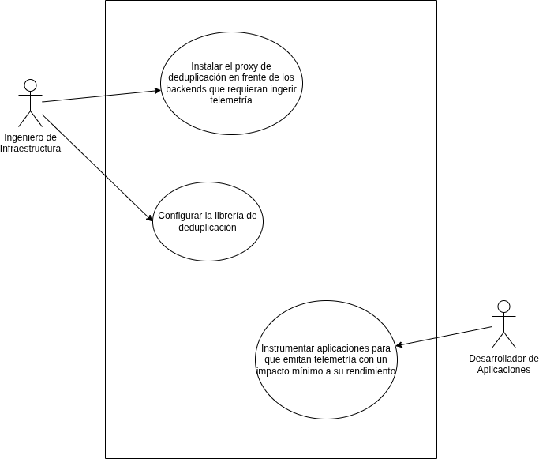
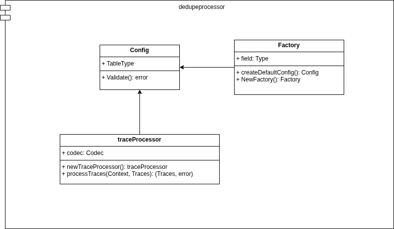

## Actividades realizadas

- Refinamiento de la librería de deduplicación
- Implementación de procesador de OpenTelemetry
- Implementación de colector customizado de OpenTelemetry
- Instrumentación de la aplicación quickpizza con el colector customizado
- Reunión de validación con el cliente

Se crearon los siguientes artefactos:

- Procesador de deduplicación: https://github.com/Tracing-Performance-Labs/dedupeprocessor
- Colector customizado: https://github.com/Tracing-Performance-Labs/custom-otel-collector

## Actividades futuras

- Implementación de codificación de trazas usando [Murmur](https://en.wikipedia.org/wiki/MurmurHash)
- Creación de recursos en AWS para ejecución de pruebas de rendimiento del colector
- Ejecución y análisis de pruebas de rendimiento del colector customizado

## Cronograma de trabajo

import { Aside } from "@astrojs/starlight/components";

Enlace al tablero Kanban: [link](https://espoldist.atlassian.net/jira/software/projects/SCRUM/boards/1).

<Aside type="tip">

Si no puede visualizar el tablero, por favor, pida acceso con su correo electrónico.

</Aside>

## Modelos desarrollados

### Casos de Uso

### Pipeline de deduplicación

### Librería de deduplicación

### Procesador de deduplicación

### Colector customizado

## Avance del Capítulo 2

Enlace al documento: [link](https://typst.app/project/r4ZV4qsFn8WHPgpNHdk5ry).
