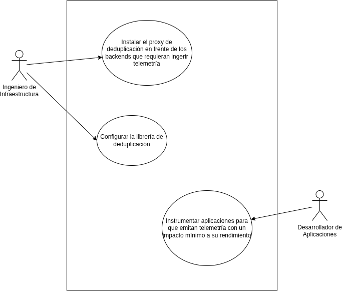
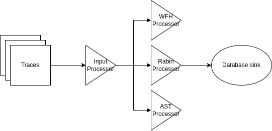
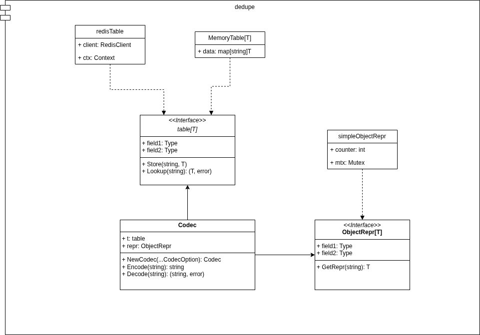
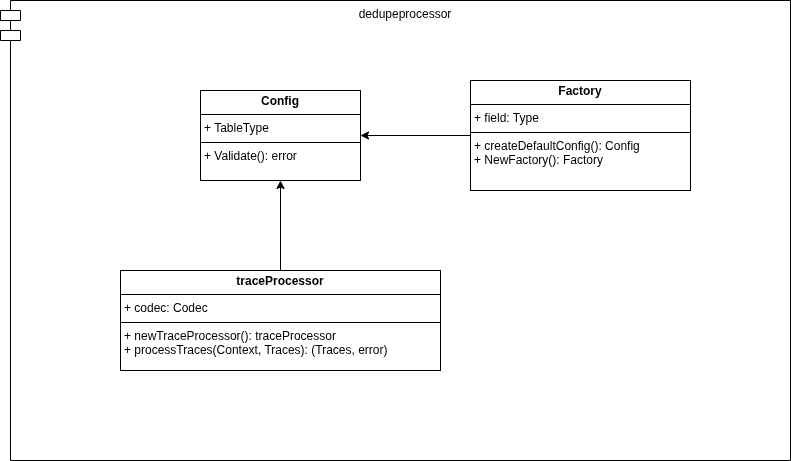
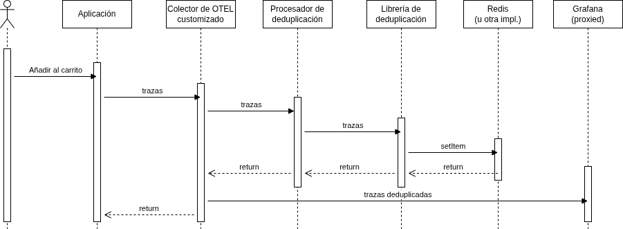

## Actividades realizadas

- Creación una configuración de [CloudFormation](https://gist.githubusercontent.com/aloussase/4334d50c79ac0643a7a32855d62df284/raw/af04786e24e2fbc7112d824edddba3465ce9e13e/dedupeprocessor-cloudformation.yml) para correr los tests en AWS Academy
- Instrumentación de la aplicación de QuickPizza con el colector default y el nuestro
- Ejecución las pruebas de rendimiento con k6

## Actividades futuras

- Realizar benchmarks en la librería de deduplicación para evaluar el mejor encoding (counter, murmur3 u otro)
- Optimizar el procesador de deduplicación
- Instrumentar otras aplicaciones y realizar pruebas con ellas
- Investigar las mejores prácticas para pruebas de rendimiento de este tipo con k6

## Cronograma de trabajo

import { Aside } from "@astrojs/starlight/components";

Enlace al tablero Kanban: [link](https://espoldist.atlassian.net/jira/software/projects/SCRUM/boards/1).

<Aside type="tip">

Si no puede visualizar el tablero, por favor, pida acceso con su correo electrónico.

</Aside>

## Modelos desarrollados

### Casos de Uso

### Pipeline de deduplicación

### Librería de deduplicación

### Procesador de deduplicación

### Colector customizado

## Presentación mejorada

<iframe
  src="https://drive.google.com/file/d/1gIsaQ9PGPwaJjT2mr43nk9FsaRaMeaso/preview"
  title="Video Presentación"
  width="100%"
  style="height: 400px;"
>
  Descarga el video desde
  [aquí](https://drive.google.com/file/d/1nGFhZGJU3y388LmLyuPzI45nahnVVqqL/view).
</iframe>

## Documento del proyecto

Enlace al documento: [link](https://typst.app/project/r4ZV4qsFn8WHPgpNHdk5ry).
