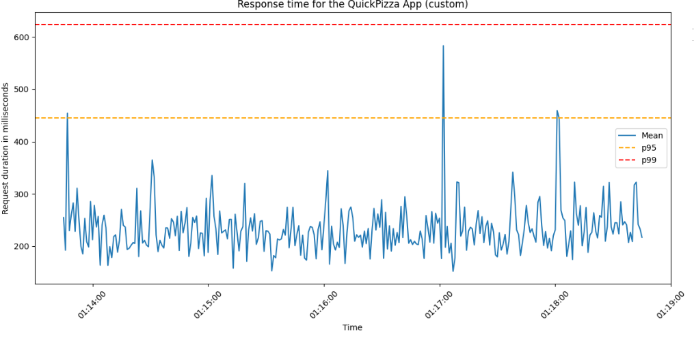
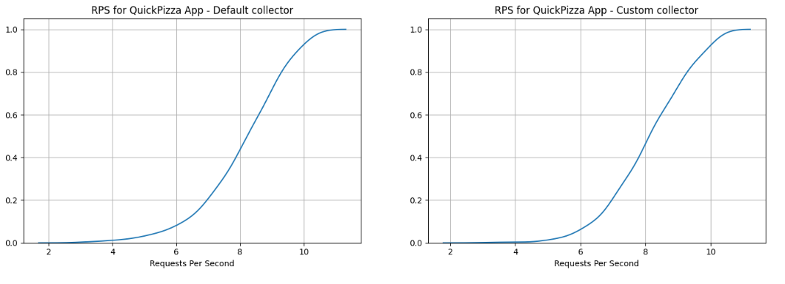

## Actividades realizadas

- Se realizaron mejoras en la libería de deduplicación
- Se actualizó la versión del colector customizado
- Se creó un template de CloudFormation para ejecutar las pruebas de rendimiento
- Se ejecutaron las pruebas de rendimiento de la solución implementada
- Se analizaron los datos resultantes de las pruebas de rendimiento

## Actividades futuras

- Analizar el almacenamiento ahorrado gracias a la solución
- Instrumentar otras aplicaciones y ejecutar pruebas de rendimiento contra ellas
- Analizar los resultados de las pruebas
- Proponer mejoras al sistema actual

## Borrardor del plan de evaluación

Se planea ejecutar pruebas de rendimiento contra otras aplicaciones y evaluar la usabilidad
del sistema en base a los criterios definidos en el capítulo II.

## Reporte de pruebas realizadas

## Cronograma de trabajo

import { Aside } from '@astrojs/starlight/components';

Enlace al tablero Kanban: [link](https://espoldist.atlassian.net/jira/software/projects/SCRUM/boards/1).

<Aside type="tip">

Si no puede visualizar el tablero, por favor, pida acceso con su correo electrónico.

</Aside>

## Documento del proyecto

Enlace al documento: [link](https://typst.app/project/r4ZV4qsFn8WHPgpNHdk5ry).
