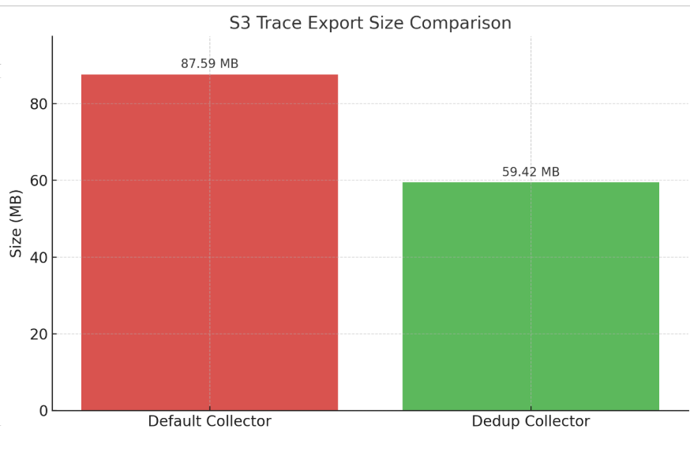

## Actividades realizadas

- Se actualizó la presentación del proyecto
- Se recopilaron datos relacionados al ahorro en recursos de almacenamiento
  gracias al sistema desarrollado
- Se presentaron los resultados del proyecto frente al cliente y otras partes
  interesadas para recibir feeback

## Actividades futuras

- Se ejecutarán un número de nuevas pruebas con diferentes configuraciones del
  sistema, de acuerdo al feedback recibido en la sesión con el cliente

## Plan de evaluación

Durante este sprint se deben terminar las nuevas pruebas de rendimiento del
sistema según lo que se conversó con el cliente.

## Reporte de pruebas realizadas

## Cronograma de trabajo

import { Aside } from "@astrojs/starlight/components";

Enlace al tablero Kanban: [link](https://espoldist.atlassian.net/jira/software/projects/SCRUM/boards/1).

<Aside type="tip">

Si no puede visualizar el tablero, por favor, pida acceso con su correo electrónico.

</Aside>

## Documento del proyecto

Enlace al documento: [link](https://typst.app/project/r4ZV4qsFn8WHPgpNHdk5ry).
